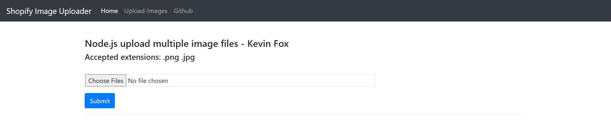

<!--
*** Thanks for checking out this README Template. If you have a suggestion that would
*** make this better, please fork the repo and create a pull request or simply open
*** an issue with the tag "enhancement".
*** Thanks again! Now go create something AMAZING! :D
***
***
***
*** To avoid retyping too much info. Do a search and replace for the following:
*** kfoxIsProgrammer, shopifyImageUploader, twitter_handle, kevindafox@gmail.com
-->


<!-- PROJECT SHIELDS -->
<!--
*** I'm using markdown "reference style" links for readability.
*** Reference links are enclosed in brackets [ ] instead of parentheses ( ).
*** See the bottom of this document for the declaration of the reference variables
*** for contributors-url, forks-url, etc. This is an optional, concise syntax you may use.
*** https://www.markdownguide.org/basic-syntax/#reference-style-links
-->


<!-- PROJECT LOGO -->
<br />
<p align="center">
  <a href="https://github.com/kfoxIsProgrammer/shopifyImageUploader">
    
  </a>

  <h3 align="center">Shopify Image Uploader</h3>

  <p align="center">
    This application is used as my project for the Winter 2021 backend internship at Shopify.
    <br />
    <a href="https://github.com/kfoxIsProgrammer/shopifyImageUploader"><strong>Explore the docs »</strong></a>
    <br />
    <br />
    <a href="https://kfoxiscoolio.com">View Demo</a>
    ·
    <a href="https://github.com/kfoxIsProgrammer/shopifyImageUploader/issues">Report Bug</a>
    ·
    <a href="https://github.com/kfoxIsProgrammer/shopifyImageUploader/issues">Request Feature</a>
  </p>
</p>


<!-- TABLE OF CONTENTS -->
## Table of Contents

* [About the Project](#about-the-project)
  * [Built With](#built-with)
* [Getting Started](#getting-started)
  * [Prerequisites](#prerequisites)
  * [Installation](#installation)
* [How to Use](#how-to-use)
* [Roadmap](#roadmap)
* [Contributing](#contributing)
* [License](#license)
* [Contact](#contact)
* [Acknowledgements](#acknowledgements)


<!-- ABOUT THE PROJECT -->
## About The Project

<p align="center">
  <a href="https://github.com/kfoxIsProgrammer/shopifyImageUploader">
    
  </a>

Here is a picture of the index page for image uploads. <br />


### Built With

* [Node.js](https://nodejs.org/en/)
* [Express](https://expressjs.com/)
* [Amazon Web Services EC2](https://aws.amazon.com/)
* [Cloudinary Cloud Services](https://cloudinary.com/?utm_source=google&utm_medium=cpc&utm_campaign=Abrand&utm_content=300754782437&utm_term=www.cloudinary.com&gclid=CjwKCAjw4rf6BRAvEiwAn2Q76iRSqb7Mp2R22tanV8uFNxx_DLw-9VUljk9SqH_QsXfg-m8OetMUehoCN4UQAvD_BwE)


<!-- GETTING STARTED -->
## Getting Started

To get a local copy up and running follow these simple steps.

### Prerequisites

This is an example of how to list things you need to use the software and how to install them.
* npm
```sh
npm install npm@latest -g
```

### Installation

1. Clone the repo
```sh
git clone https://github.com/kfoxIsProgrammer/shopifyImageUploader.git
```
2. Install NPM packages
```sh
npm install
```

### How to use
1. Select choose files and select any png or jpeg image.
2. Click submit.
3. The images are sent to my server and parsed using multer middleware
4. The images are placed on the server locally and then sent to Cloudinary server for automatic img tags to be created.
5. The img tags, local location and cloud location for each image is stored in a mongoDB database.


<!-- ROADMAP -->
## Roadmap

See the [open issues](https://github.com/kfoxIsProgrammer/shopifyImageUploader/issues) for a list of proposed features (and known issues).

This Project was my intial attempt at the Shopify Winter 2021 backend internship. I built the upload feature to my server.


<!-- CONTRIBUTING -->
## Contributing

Contributions are what make the open source community such an amazing place to be learn, inspire, and create. Any contributions you make are **greatly appreciated**.

1. Fork the Project
2. Create your Feature Branch (`git checkout -b feature/AmazingFeature`)
3. Commit your Changes (`git commit -m 'Add some AmazingFeature'`)
4. Push to the Branch (`git push origin feature/AmazingFeature`)
5. Open a Pull Request


<!-- LICENSE -->
## License

Distributed under the MIT License. See `LICENSE` for more information.


<!-- CONTACT -->
## Contact

Kevin Fox - kevindafox@gmail.com

Project Link: [https://github.com/kfoxIsProgrammer/shopifyImageUploader](https://github.com/kfoxIsProgrammer/shopifyImageUploader)


<!-- MARKDOWN LINKS & IMAGES -->
<!-- https://www.markdownguide.org/basic-syntax/#reference-style-links -->
[contributors-shield]: https://img.shields.io/github/contributors/kfoxIsProgrammer/repo.svg?style=flat-square
[contributors-url]: https://github.com/kfoxIsProgrammer/repo/graphs/contributors
[forks-shield]: https://img.shields.io/github/forks/kfoxIsProgrammer/repo.svg?style=flat-square
[forks-url]: https://github.com/kfoxIsProgrammer/repo/network/members
[stars-shield]: https://img.shields.io/github/stars/kfoxIsProgrammer/repo.svg?style=flat-square
[stars-url]: https://github.com/kfoxIsProgrammer/repo/stargazers
[issues-shield]: https://img.shields.io/github/issues/kfoxIsProgrammer/repo.svg?style=flat-square
[issues-url]: https://github.com/kfoxIsProgrammer/repo/issues
[license-shield]: https://img.shields.io/github/license/kfoxIsProgrammer/repo.svg?style=flat-square
[license-url]: https://github.com/kfoxIsProgrammer/repo/blob/master/LICENSE.txt
[linkedin-shield]: https://img.shields.io/badge/-LinkedIn-black.svg?style=flat-square&logo=linkedin&colorB=555
[linkedin-url]: https://linkedin.com/in/kfoxIsProgrammer
[product-screenshot]: images/screenshot.png
